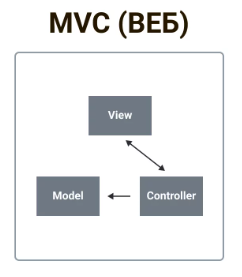

[⇐ readme](../readme.md)

## Model-View-Controller
Паттерн даёт возможность отделить бизнес-логику от представления.

---


<b>Controller</b>
1. Обрабатывает действия пользователя (нажатие кнопки и т.п.);
2. Валидирует и обрабатывает данные, может проверять права доступа;
3. Отдаёт данные модели.

<b>Model</b>
1. Обрабатывает данные;
2. Совершает запросы к API;
3. Вызывает обновление представления:
   1. через метод представления;
   2. паттерн [MVC-WATCHER](MVC-WATCHER.md);
   3. обновление может быть реактивным.

<b>View</b>
1. Обрабатывает и меняет данные в представлении.
2. Подставляет нужный `controller` по паттерну [MVC-STRATEGY](MVC-STRATEGY.md)

<b>User</b> ~ UI

## MVC (ВЕБ)

---



## Attention

---

Начинающие программисты очень часто трактуют архитектурную модель MVC 
<br>как пассивную модель MVC: модель выступает исключительно совокупностью функций для доступа 
к данным, а контроллер содержит бизнес-логику.

**ТТУК** («Толстые, тупые, уродливые контроллеры»; Fat Stupid Ugly Controllers):
```text
Среднестатистический ТТУК получал данные из БД 
(используя уровень абстракции базы данных, делая вид, что это модель) 
или манипулировал, проверял, записывал, а также передавал данные в Представление. 

Такой подход стал очень популярен потому, что использование таких контроллеров 
похоже на классическую практику использования отдельного php-файла 
для каждой страницы приложения.
```

Но в объектно-ориентированном программировании используется активная модель MVC, 
<br>где модель — это не только совокупность кода доступа к данным и СУБД, 
<br>но и вся бизнес-логика.
<br>Также модели могут инкапсулировать в себе другие модели. 

<br>Контроллеры же, — как элементы информационной системы, — ответственны лишь за:
1. Приём запроса от пользователя;
2. Анализ запроса;
3. Выбор следующего действия системы, соответственно результатам анализа 
(например, передача запроса другим элементам системы).

Только в этом случае контроллер становится «тонким» и выполняет исключительно 
<br>функцию связующего звена (`glue layer`) между отдельными компонентами информационной системы.
