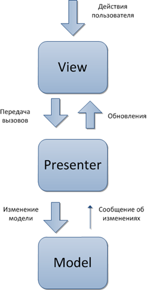

[⇐ readme](../readme.md)

## Model-View-Presenter
Паттерн даёт возможность отделить бизнес-логику от представления.

---

Представлению нет надобности подписываться на изменения модели, 
 теперь контроллер, переименованный в Presenter дает знать представлению об изменениях.

Данный подход позволяет создавать абстракцию представления.
 Реализовать данный паттерн можно при помощи вынесения интерфейсов представления. 

У каждого представления будут интерфейсы с определенными наборами методов и свойств, 
 необходимых презентеру, презентер в свою очередь инициализируется с данным интерфейсом,
 подписывается на события представления и по необходимости подсовывает данные. 

Данный подход позволяет разрабатывать приложения
с использованием методологии [TDD (Test-driven development)](../TDD/TDD.md).
